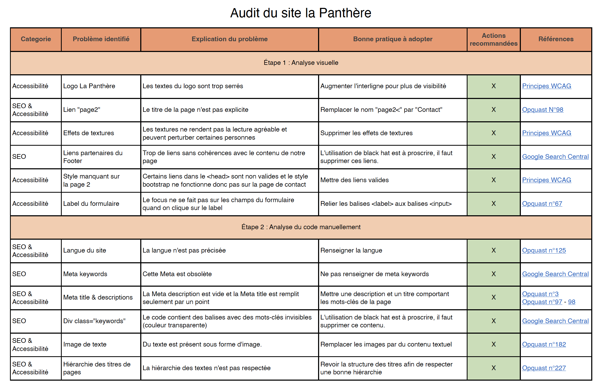
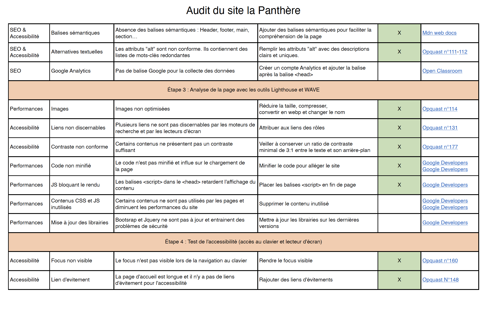

# Optimisez un site web existant  
Quatrième projet du parcours dévelopeur web chez OpenClassrooms. 
L'objectif est __d'améliorer les performances, le SEO et l'accessibilité d'un site web existant__

## Scénario 
Vous travaillez pour l'agence La Panthère, une grande agence de web design basée à Lyon. L’activité de l’entreprise a bien démarré mais aujourd’hui, elle est en perte de vitesse. La fondatrice de l’entreprise, Sophie, cherche une solution pour faire repartir l’activité. En tapant “Entreprise web design Lyon” sur Internet, elle s’aperçoit que le site de l’agence apparaît seulement en deuxième page des moteurs de recherche. Vous êtes chargé de l'optimisation du SEO, de l'accessibilité et de la performance du site. 

## Optimisations attendues  

1. __Analyse de l’état actuel de SEO du site fourni__  
Indiquer les parties du site qui ne sont pas optimisées pour le SEO et qui ne sont pas à jour en termes d’accessibilité dans un tableau Excel. 

  

  

2. __Optimisation du site__  
Appliquer les recommandations de l'audit réalisé au contenu et au code source. Le site doit passer le W3C pour HTML et CSS.  

3. __Comparaison des résultats__  
Comparaison des performances entre la version du site actuelle optimisée et rédaction d'un rapport d'optimisation qui démontre l'amélioration des performances, du SEO et de l'accessibilité.

## Compétences évaluées  
- Réaliser une recherche des bonnes pratiques en développement web  
- Optimiser la taille et la vitesse d’un site web   
- Optimiser le référencement d'un site web  
- Assurer l'accessibilité d'un site web  